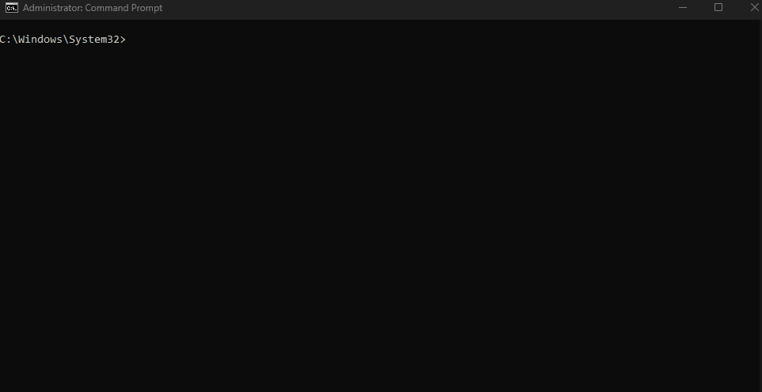

# Installation Guide

Cross-platform password generator using Python's `secrets` module for cryptographically secure random generation.

## Demo



## Requirements

- Python 3.6+
- pip (optional, for clipboard support)

## Quick Start

### Windows

```cmd
git clone https://github.com/yourusername/strong-password-generator.git
cd strong-password-generator
install.bat
```

### Linux/macOS

```bash
git clone https://github.com/yourusername/strong-password-generator.git
cd strong-password-generator
chmod +x install.sh && ./install.sh
source ~/.bashrc
```

## Usage

### Interactive Mode
```bash
passgen
```

### CLI Examples

```bash
# Generate 16-char password with symbols and numbers
passgen -l 16 -s -n

# Generate multiple passwords
passgen -l 20 -s -n -c 5

# Use presets
passgen --preset wifi      # 16-char, no ambiguous
passgen --preset strong    # 24-char, max security
passgen --preset pin       # 6-digit numeric

# Analyze password strength
passgen --check "YourPassword123"

# Save to file
passgen -l 16 -s -n --save output.txt
```

## Options

| Flag                      | Description            | Default |
|---------------------------|------------------------|---------|
| `-l, --length`            | Password length        | 16      |
| `-c, --count`             | Number to generate     | 1       |
| `-s, --symbols`           | Include symbols        | false   |
| `-n, --numbers`           | Include numbers        | false   |
| `-x, --exclude-ambiguous` | Exclude il1Lo0O        | false   |
| `--save FILE`             | Save to file           | -       |
| `--check PASSWORD`        | Analyze strength       | -       |
| `--preset TYPE`           | Use preset config      | -       |

## Presets

| Preset   | Length | Chars                              | Use Case                |
|----------|--------|------------------------------------|-------------------------|
| `wifi`   | 16     | Alphanumeric+symbols, no ambiguous | Easy to type on devices |
| `strong` | 24     | All characters                     | Maximum security        |
| `pin`    | 6      | Numeric only                       | PIN codes               |
| `basic`  | 12     | Alphanumeric, no ambiguous         | Basic passwords         |
| `max`    | 32     | All characters                     | Ultra-secure            |

## Security Features

- CSPRNG via Python's `secrets` module
- Entropy calculation for strength rating
- Character diversity enforcement
- No password storage (ephemeral by default)

## Troubleshooting

**Command not found after install:**
```bash
# Linux/macOS
source ~/.bashrc

# Windows
# Reopen Command Prompt
```

**Python not in PATH (Windows):**
- Reinstall Python with "Add to PATH" option checked
- Or use: `py passgen.py` directly

## License

MIT

## Author

Kote Shaburishvili